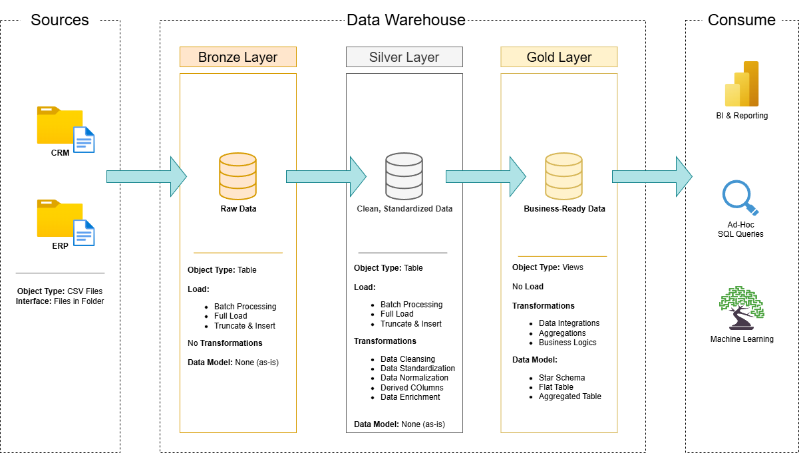

# SQL Data Warehouse Project

Welcome to my **SQL Data Warehouse Project** repository.  
This project documents the end-to-end development of a modern data warehouse built in **SQL Server**, from raw source ingestion to transformed analytical models and reporting-ready datasets.

The goal of this project is to demonstrate practical skills in **data engineering, ETL development, data modeling, and analytics** through a hands-on portfolio project based on real warehouse design principles.

---

## Data Architecture

This project is organized using a **Medallion Architecture** approach with **Bronze**, **Silver**, and **Gold** layers.



### Bronze Layer
The bronze layer stores raw source data in its original form. In this project, data from CSV files is loaded into SQL Server without major transformation so the original records are preserved.

### Silver Layer
The silver layer is where data preparation happens. This includes cleaning, standardizing, validating, and reshaping the raw data so it becomes more consistent and reliable for downstream use.

### Gold Layer
The gold layer contains business-ready data modeled for reporting and analytics. This is where the warehouse is structured into fact and dimension tables to support easier querying and insight generation.

---

## Project Overview

This project covers the main stages of building a modern analytical data platform in SQL Server:

1. **Warehouse Design**  
   Designing a layered data warehouse using Bronze, Silver, and Gold architecture.

2. **ETL Development**  
   Building SQL-based workflows to extract, load, clean, and transform source data.

3. **Dimensional Modeling**  
   Creating fact and dimension tables to support analytical queries and reporting.

4. **Analytics and Reporting**  
   Writing SQL queries to explore business performance, trends, and operational insights.

This repository serves as a portfolio project for demonstrating skills in:

- SQL Development
- Data Warehousing
- ETL Pipeline Design
- Data Modeling
- Data Engineering
- Analytics and Reporting

---

## Project Requirements

### Building the Data Warehouse

#### Objective
Build a modern SQL Server data warehouse that consolidates sales-related data from multiple systems into a single analytical model that can support reporting and business decision-making.

#### Specifications
- **Data Sources**: Load data from two source systems, ERP and CRM, provided as CSV files.
- **Data Quality**: Identify and address quality issues before the data is used for analytics.
- **Integration**: Merge both source systems into a unified and analysis-friendly model.
- **Scope**: Focus on the most current available dataset; historical tracking is not included in this version.
- **Documentation**: Document the data model, transformations, and naming conventions clearly for future reference.

---

### Analytics and Reporting

#### Objective
Use SQL queries to generate business insights from the warehouse, with a focus on:

- **Customer behavior**
- **Product performance**
- **Sales patterns**

The final analytical layer is designed to help answer business questions and support better decision-making through structured reporting.


---

## Repository Structure

```text
sql-data-warehouse-project/
│
├── datasets/                           # Source datasets used in the project (ERP and CRM CSV files)
│
├── docs/                               # Project documentation, diagrams, and reference materials
│   ├── data_architecture.drawio        # High-level warehouse architecture
│   ├── data_catalog.md                 # Dataset field definitions and metadata
│   ├── data_integration.drawio         # Data flow diagram
│
├── scripts/                            # SQL scripts for ingestion, transformation, and modeling
│   ├── bronze/                         # Raw data load scripts
│   ├── silver/                         # Cleaning and transformation scripts
│   ├── gold/                           # Business-ready model creation scripts
│
├── tests/                              # Data quality checks and validation scripts
│
├── README.md                           # Project overview and documentation
├── LICENSE                             # License information
├── .gitignore                          # Ignored files and folders
└── requirements.txt                    # Project dependencies and setup notes
```
## Key Takeaways

Through this project, I gained hands-on experience with:

- Designing a layered warehouse architecture
- Building SQL-based ETL workflows
- Cleaning and transforming source data for analytics
- Modeling business data using fact and dimension tables
- Writing analytical SQL queries for reporting and insight generation
